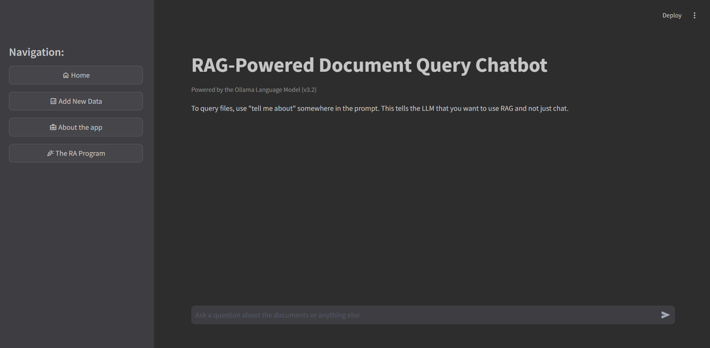
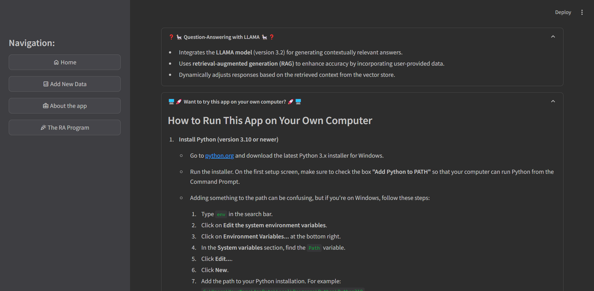
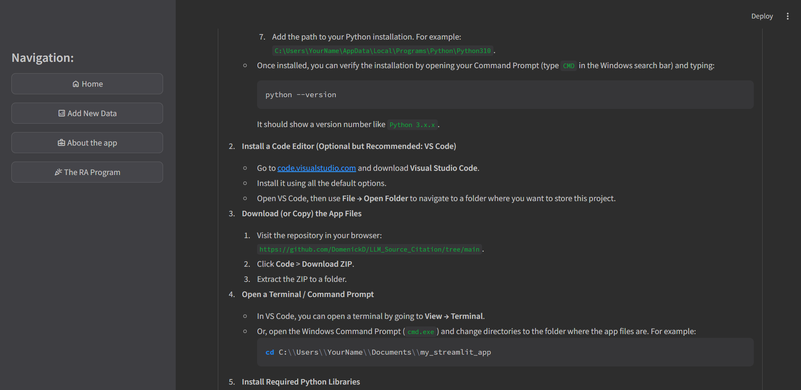

# Ollama RAG Chatbot

To Run: 
1. Install the required libraries by running `pip install -r requirements.txt` in your terminal.

2. Switch to project directory:
```cd Projectv5```

3. Train the model on teh training data with:
```train_model.py```
This will train the model on all files in the data folder.

4. Run the chatbot with:
```streamlit run app.py```

# LLM Demonstration

This section showcases the step-by-step functionality of the LLM through individual screenshots, followed by an animated GIF summarizing the interaction.

## Summary GIF

Below is an animated GIF summarizing the demonstration:


## Screenshots








